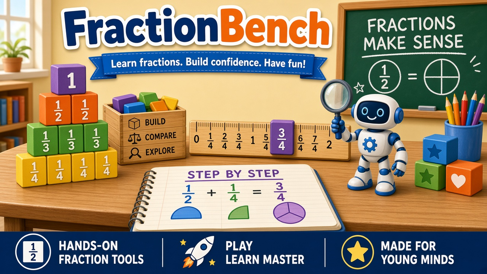

# FractionBench

FractionBench is a local fraction tool for equivalent fractions and fraction addition. A learner enters structured steps. The checker compares each step with the one before it, using exact rational arithmetic, and stops at the first line that changes the value. A fraction strip or a number line explains that line. Two fresh practice problems can follow.

Pip, the helper, is a presentation layer: level art, original looping themes, and optional read-aloud. Pip reads the checker's result. Pip does not decide whether a step is valid.

The [IES fractions practice guide](https://ies.ed.gov/ncee/WWC/PracticeGuide/15/Published) (September 2010; link checked October 6, 2026) recommends teaching fractions as numbers, explaining why a procedure works, and using number lines. Those ideas shaped the visuals and the wording. The guide does not validate FractionBench, and these tests do not measure learning.

## Run it

```bash
npm install
npm run dev
```

Open the URL Vite prints. It is a loopback address. After install, the app does not need a network connection. `npm run build` then `npm run preview` serves the production bundle the same way. This project does not claim to work from a `file://` URL.

## Tests

```bash
npm test
npm run test:browser
```

The latest local results are in [Test results](#test-results) below. Those numbers are from commands that were actually run.

## Supported grammar

A line is one fraction, or a sum of two fractions. Numerators and denominators are whole numbers the learner types. Numerators may be 0 through 999. Denominators may be 1 through 999. A blank, a decimal, or a denominator of 0 is invalid input, not a scored answer. Values outside that range are explained and are not shortened to fit.

A step may name a reason:

- rewrite an equivalent fraction
- multiply the top and bottom by the same positive integer
- divide the top and bottom by the same positive integer, exactly
- combine fractions that already share a denominator
- reorder the two addends
- another method

"Another method" on a sum that lands on the exact single-fraction sum is labeled a **correct equivalent result**. A common-denominator breakdown is checked only when the learner shows those steps. Up to 12 steps. No general algebra, and no evaluation of typed JavaScript.

## What the checker accepts

- Unsimplified fractions.
- Any common denominator, not only the least one.
- Simplifying before adding, after adding, or not at all, unless the problem asked for simplest form or a specific denominator.
- A later mathematical error even when an earlier line preserved the value but used a reason the checker cannot verify.

A matching final answer does not erase an earlier mathematical error. An unchanged line preserves the value and does not finish the problem.

## Limitations

- No multiplication or division of fractions, negatives, mixed numbers, or algebra.
- No handwriting, photos, chat, or a language model.
- No accounts, backend, database, analytics, or saved learner work. Progress lives in memory for the tab and disappears on refresh.
- The reason checker is a small rule list, not a proof system. A value can match while the reason stays unverified.
- Partition drawings stop at denominator 60. Larger fractions stay in exact text, with a simpler equal model only when that model is labeled as simpler.
- Decorative art is not a math model. Strips and number lines are drawn from the rationals.

## Privacy

There is no account and no learner profile. Session state is React state only. The source does not call `localStorage`, `sessionStorage`, analytics, or a remote API. Music is synthesized in the browser from note numbers in `src/audio/themes.ts`. Read-aloud uses `SpeechSynthesis` only after the learner turns it on. Some browsers' built-in speech may contact that browser's voice service; the switch ships off. No cloud TTS key is used.

Demo text in the interface is not a real child. There are no ages, schools, or contact details.

## Art, music, and voice

- Cover: `docs/cover.jpg`, also shown in the header.
- Level-art direction: `docs/level-art-reference.jpg`.
- Runtime art is local SVG in `src/game/art.tsx`: Equivalent Workshop, Addition Trail (a number line from 0 to 2), Pip idle / thinking / cheering, and icons for check, hint, edit, and try two more.
- Themes: title, workshop, trail, a short success sting, and a soft falling major third for "let's look again". All sine waves. Music and sound effects have separate switches and start off.
- Script: `docs/dialogue-script.md`. Casting notes: `docs/voice-casting.md`.

The attached JPEG bytes were not on disk in this workspace, so the two files in `docs/` were regenerated to match that art direction. They are illustrations. They are not the checker's drawings.

## Accessibility

See `docs/accessibility.md`. Keyboard labels, a polite live region, text next to every drawing, and a reduced-motion stylesheet are in the app. That is not an accessibility certification. A screen-reader walkthrough by a person has not been done.

## Release review

The 30-case checklist is `docs/review-checklist.md`. Implementation review used exact arithmetic. **Tutor/content-owner review of all 30 cases is still pending** and is a release gate before real learner use.

## Test results

Recorded from the commands below on October 6, 2026, against this tree. `npx tsc --noEmit` is also the first step of `npm run build`, which the browser run executes before Playwright starts.

| Command | Result |
| --- | --- |
| `npx tsc --noEmit` | Passed. No compiler output. |
| `npm test` | Vitest 3.2.4. 9 files, 64 passed, 0 failed. About 2.05s. |
| `npx playwright test` | 3 passed, 0 failed. About 11.8s. System Chrome. |

The browser run covered switches starting off, no request host other than loopback, a checked mathematical error, an unverified reason, keyboard edit, practice, a completed level star, a 390px-wide layout, and a 640px-wide layout. 640 CSS pixels is the reflow width of a 1280px window at 200% zoom. That run does not drive the browser chrome zoom menu.

A separate local pass of the preview, after the same build, read the error-step strip text as `1/2 · 1 of 2 parts` and `2/3 · 2 of 3 parts`, saw Pip's cheering label after a fully checked goal, and measured no horizontal overflow at 390 CSS pixels. Favicon and page requests stayed on `127.0.0.1`.

These commands do not replace tutor review of the 30 cases, and they do not measure whether a learner understands fractions.
